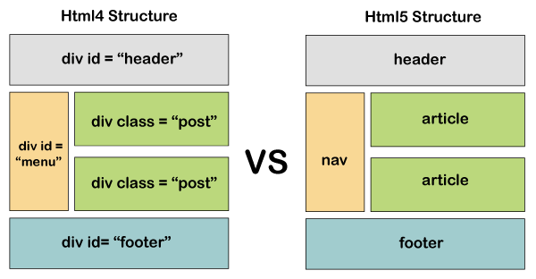

# Difference between HTML4 and HTML5

&nbsp;

&nbsp;

# Difference between HTML and HTML5

| Features              | Html                                                                                                                                                     | Html5                                                                                                                                              |
| --------------------- | -------------------------------------------------------------------------------------------------------------------------------------------------------- | -------------------------------------------------------------------------------------------------------------------------------------------------- |
| Definition            | HTML is the primary language for developing web pages.                                                                                                   | HTML5 is a new version of HTML with new functionalities with markup language and Internet technologies.                                            |
| Multimedia support    | HTML does not have support for video and audio.                                                                                                          | HTML5 supports both video and audio.                                                                                                               |
| Storage               | The HTML browser uses cache memory as temporary storage.                                                                                                 | HTML5 has the storage options like: **_application cache, SQL database,_** and **_web storage_**.                                                  |
| Browser compatibility | HTML is compatible with almost all browsers because it has been present for a long time, and the browser made modifications to support all the features. | In HTML5, we have many new tags, elements, and some tags that have been `removed/modified`, so only some browsers are fully compatible with HTML5. |
| Vector and Graphics   | In HTML, vector graphics are possible with tools LikeSilver **_light, Adobe Flash, VML_**, etc.                                                          | In HTML5, vector graphics are supported by default. Vector graphics is an integral part of HTML5, SVG and canvas.                                  |
| Threading             | In HTML, the browser interface and JavaScript running in the same thread.                                                                                | The HTML5 has the JavaScript Web Worker API, which allows the browser interface to run in multiple threads.                                        |
| Doctype declaration              | Doctype declaration in html is too long `<! DOCTYPE HTML PUBLIC "- // W3C // DTD HTML 4.01 // EN" "http://www.w3.org/TR/html4/strict.dtd"> `             | The DOCTYPE declaration in html5 is very simple `<! DOCTYPE html>  `                                                                               |
| Character Encoding    | Character encoding in HTML is too long. `<! DOCTYPE HTML PUBLIC "- // W3C // DTD HTML 4.0 Transitional // EN">`                                          | Character encoding declaration is simple `<meta charset = "UTF-8">`                                                                                |
| Shapes                | It is not possible to create shapes like circles, rectangles, triangles.                                                                                 | We can draw shapes like circles, rectangles, triangles.                                                                                            |
|                       |                                                                                                                                                          |

&nbsp;
