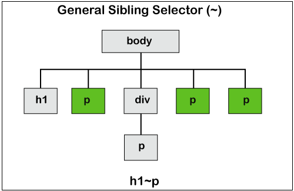

# Overview

- All CSS Combinator Selectors
- Descendant Selector (space)
- Child Selector (>)
- adjacent sibling selector (+)
- general sibling selector (~)

&nbsp;

&nbsp;

&nbsp;

# Chapter Summary

- A combinator explains the relationship between the selectors.

- The descendant selector matches all elements that are descendants of a specified element.

- The word **descendant** indicates nested anywhere in the DOM tree. It can be a direct child or deeper than five levels, but it will still be referred to as a descendant.

- The child selector selects all elements that are the children of a specified element.

- The adjacent sibling selector is used to select an element that is directly after another specific element.

- Sibling elements must have the same parent element, and "**adjacent**" means "**immediately following**".

&nbsp;

&nbsp;

# All CSS Combinator Selectors

| Name                          | Syntax            | Example | Example description                                                                |
| ----------------------------- | ----------------- | ------- | ---------------------------------------------------------------------------------- |
| descendant selector           | element element   | div p   | Selects all `<p>` elements inside `<div>` elements                                 |
| child selector (>)            | element>element   | div > p | Selects all `<p>` elements where the parent is a `<div>` element                   |
| adjacent sibling selector (+) | element+element   | div + p | Selects the first `<p>` element that are placed immediately after `<div>` elements |
| general sibling selector (~)  | element1~element2 | p ~ ul  | Selects every `<ul>` element that are preceded by a `<p>` element                  |
|                               |                   |         |                                                                                    |

&nbsp;

&nbsp;

# Combinator

A combinator explains the relationship between the selectors.

- A CSS selector can contain more than one simple selector. Between the simple selectors, we can include a combinator.

- There are **four** different combinator in CSS:
  - descendant selector (space)
  - child selector (>)
  - adjacent sibling selector (+)
  - general sibling selector (~)

&nbsp;

&nbsp;

# Descendant Selector

The descendant selector matches all elements that are descendants of a specified element.

&nbsp;

## Example

```css
div p {
  background-color: yellow;
}
```

&nbsp;


&nbsp;

- The word **descendant** indicates nested anywhere in the DOM tree. It can be a direct child or deeper than five levels, but it will still be referred to as a descendant.

&nbsp;

&nbsp;

# Child Selector (>)

The child selector selects all elements that are the children of a specified element.

&nbsp;

## Example

```css
div > p {
  background-color: yellow;
}
```

&nbsp;


&nbsp;

&nbsp;

# Adjacent Sibling Selector (+)

The adjacent sibling selector is used to select an element that is directly after another specific element.

Sibling elements must have the same parent element, and "**adjacent**" means "**immediately following**".

&nbsp;

# Example

```css
p + p {
  background-color: yellow;
}
```

&nbsp;


&nbsp;

&nbsp;

# General Sibling Selector (~)

The general sibling selector selects all elements that are next siblings of a specified element.

The following example selects all `<p>` elements that are next siblings of `<h1>` elements:

&nbsp;

# Example

```css
h1 ~ p {
  background-color: yellow;
}
```

&nbsp;

&nbsp;



&nbsp;

&nbsp;
