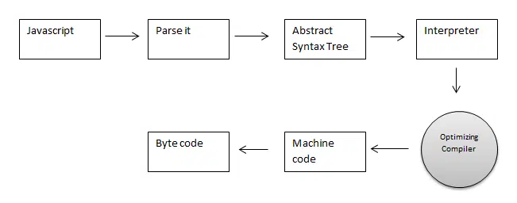

# Overview

HTML = Skeleton

CSS = Styling

JavaScript = Logic

&nbsp;

&nbsp;

JavaScript is not understandable by computer but the only browser understands JavaScript. So, we need a program to convert our JavaScript program into computer-understandable language.

Browser has an embedded engine called **JavaScript engine** or the **JavaScript Runtime** for this.

&nbsp;

&nbsp;

# JavaScript Engine

A `JavaScript engine` is a computer program that executes JavaScript code and converts it into computer understandable language.

&nbsp;

&nbsp;

&nbsp;

&nbsp;

# List of JavaScript Engines:

| Browser                  | Name of Javascript Engine |
| ------------------------ | ------------------------- |
| Google Chrome            | V8                        |
| Edge (Internet Explorer) | Chakra                    |
| Mozilla Firefox          | Spider Monkey             |
| Safari                   | Javascript Core Webkit    |

&nbsp;

&nbsp;

# Developer tools

Every browser has same developer tools which makes a developer's life so easier.

|Tools|Contains|
|-|-|
|Elements| All HTML elements|
|Console| All the errors and logs|
|Network| All network requests|

&nbsp;

&nbsp;

&nbsp;

&nbsp;

&nbsp;

&nbsp;

&nbsp;

&nbsp;

&nbsp;

&nbsp;

