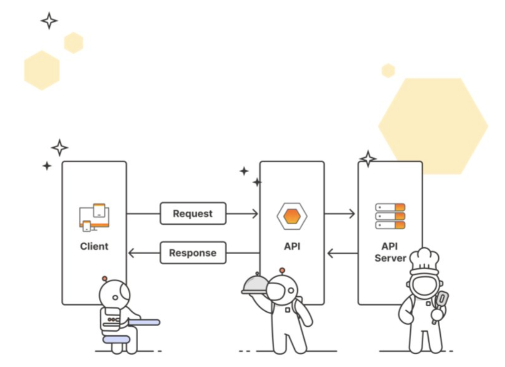

# Overview

- What is API
- Why are APIs important
- How do APIs work
- Who works with APIs
- Who benefits from APIs

&nbsp;

&nbsp;

&nbsp;

# What is API

API stands for **Application Programming Interface**

An API is a contract that allows code to talk to other code.

APIs are the building blocks of modern software because they allow for sharing of resources and services across applications, organizations, and devices.

Interface can be thought of as a contract of service between two applications. This contract defines how the two applications communicate with each other using requests and responses. Their API documentation contains information on how developers are to structure those requests and responses.

&nbsp;

&nbsp;

# Why are APIs important

1. APIs help developers **integrate exciting features and build automation** without reinventing the wheel. Ex: using a Weather API instead of launching your weather balloons

2. APIs allow enterprises to **open up their product** for faster innovation. Ex: apps that interact with Twitter or Meta APIs by posting on your behalf or reading tweets

3. APIs can be products themselves. Ex: Software as a Service (SaaS) products like Stripe's payment APIs or Twilio's text messaging and email APIs

&nbsp;

&nbsp;

# How do APIs work

API architecture is usually explained in terms of **client** and **server**

The application **sending the request** is called the **client**, and the application **sending the response** is called the **server**.

&nbsp;

&nbsp;

There are **four** different ways that APIs can work depending on when and why they were created.

- **_SOAP APIs_** (Simple Object Access Protocol)
- **_gRPC APIs_** (google Remote Procedure Calls)
- **_Websocket APIs_**
- **_REST APIs_** (Representational State Transfer)

&nbsp;

&nbsp;

# Who works with APIs

APIs are not just for **developers**. According to Postman's latest State of the API Report, almost half of the survey respondents identified as holding non-developer roles, such as **management, solutions architects, business and data analysts, educators and researchers**. All these roles benefit from the standardized data access provided by APIs.

API use is not limited to the tech and IT industries. Survey responses in the same report show that while tech, business, IT, and banking sectors represent the bulk of API use, any industry can benefit from the convenience provided by APIs.

&nbsp;

&nbsp;

# Who benefits from APIs?

Ultimately, **everyone** benefits from APIs either directly or indirectly because APIs make processes more efficient and connect the services we love and rely on.

&nbsp;
&nbsp;

&nbsp;
