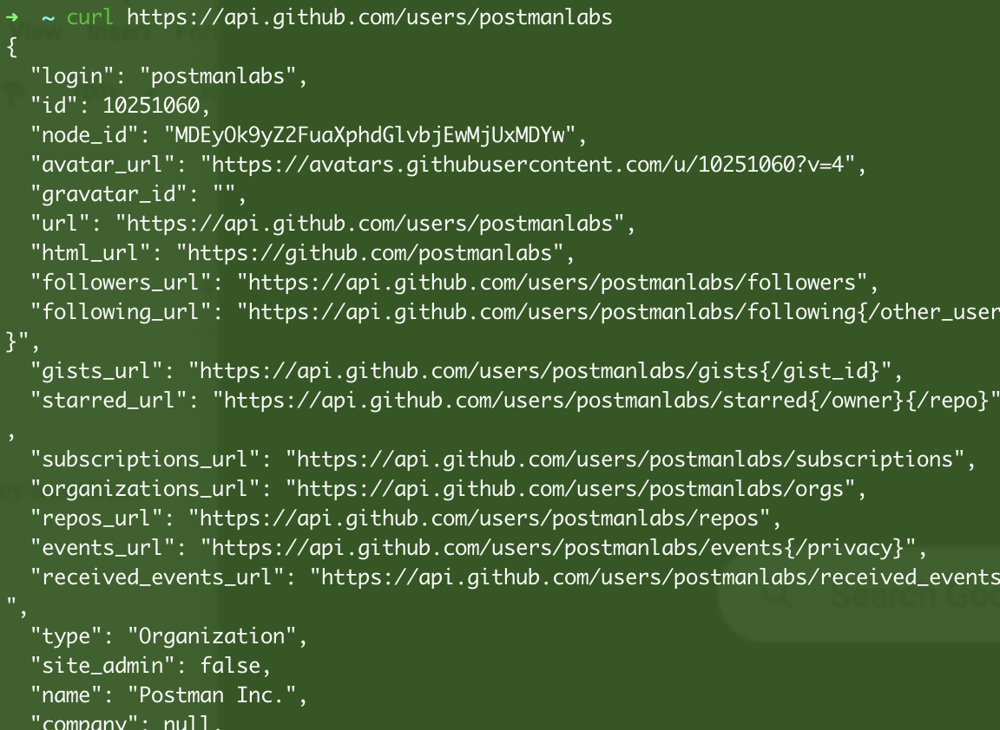
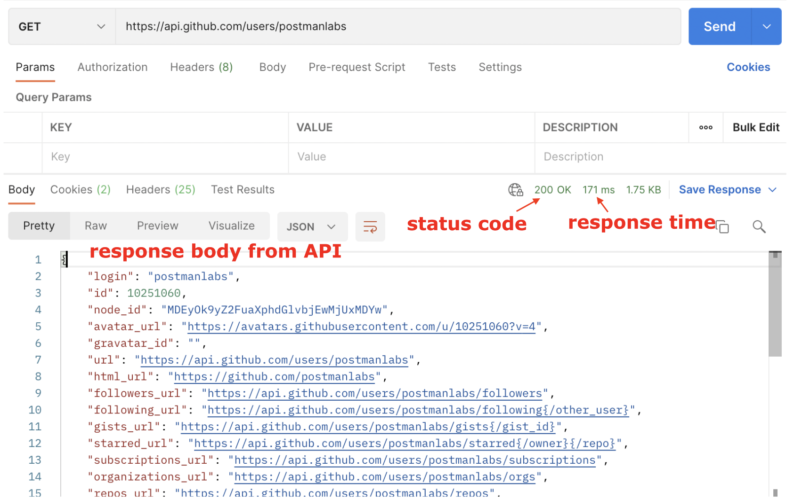

# Overview

- An API Platform
- The founders
- Working with APIs then and now: cURL vs. Postman
- Based on Access

&nbsp;

&nbsp;

&nbsp;

# An API Platform

Postman is an API platform for building and using APIs. Postman simplifies each step of the API lifecycle and streamlines collaboration so you can create better APIs faster and consume them with ease. That's why Postman is trusted by over 25 million users worldwide!

&nbsp;

&nbsp;

# The founders

Postman started simply as a side project to solve a specific problem: **_Abhinav Asthana_**, **Postman's CEO and co-founder**, set out to create a tool that would simplify the API testing process. As the tool's usage quickly exploded, Abhinav recruited two of his former colleagues, **Ankit Sobti** and **Abhijit Kane**, to help him create Postman, Inc. Postman is now the world's leading API platform, and the three founders still lead the company to this day.

&nbsp;

&nbsp;

# Working with APIs then and now: cURL vs. Postman

Before Postman, it was common practice to poke at APIs with a _command line tool_ for making HTTP requests called **_cURL_**. This tool is still used today but has its limitations when it comes to collaboration and sharing.

&nbsp;

## API calls with curl

This is an example of what an API call in the terminal using the curl command looks like. Here we are fetching data about GitHub user postmanlabs

```md
curl https://api.github.com/users/postmanlabs
```



&nbsp;

It works great, but once we make the call, the API response data is lost in the river of the terminal. You also don't have visibility of the metadata of the response without adding more details to the command.

&nbsp;

&nbsp;

## API calls with Postman

Here is the same call done with Postman. Postman shows the response with clean indents and colors and allows you to save, organize and share your requests. You can also see all the components of the request and response broken down into tabs and other helpful details like the response time and status code.

&nbsp;



&nbsp;

&nbsp;

# The API First World

Postman has a vision for an API First World - one where 100 million developers are connected through APIs, and APIs take center stage as primary building blocks. In the API-first world:

- APIs are considered a #1 priority
- APIs are easily consumable
- APIs are easily discoverable

&nbsp;
&nbsp;

&nbsp;
