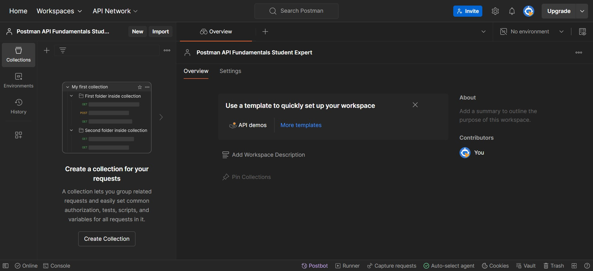

# Overview

- Create a workspace

&nbsp;

&nbsp;

&nbsp;

# Workspace

Workspaces enable you to organize your Postman work and collaborate with teammates.

You can group your projects together, with workspace acting as the single source of truth for related APIs, collections, environments, mocks, monitors, and other linked elements.

&nbsp;

&nbsp;

# Create a workspace

To start making Postman requests, we need to be inside a workspace.

Steps to create works space :

1. **Workspaces** dropdown > **Create Workspace**

2. Select Blank Workspace as Template

3. Name your workspace "workspace_name" and set the visibility to Personal. Then click **"Create Workspace"**

&nbsp;

&nbsp;

&nbsp;

&nbsp;

&nbsp;

&nbsp;

&nbsp;

&nbsp;
