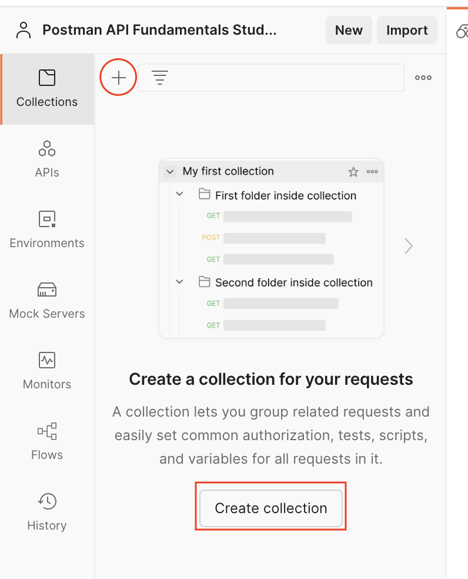
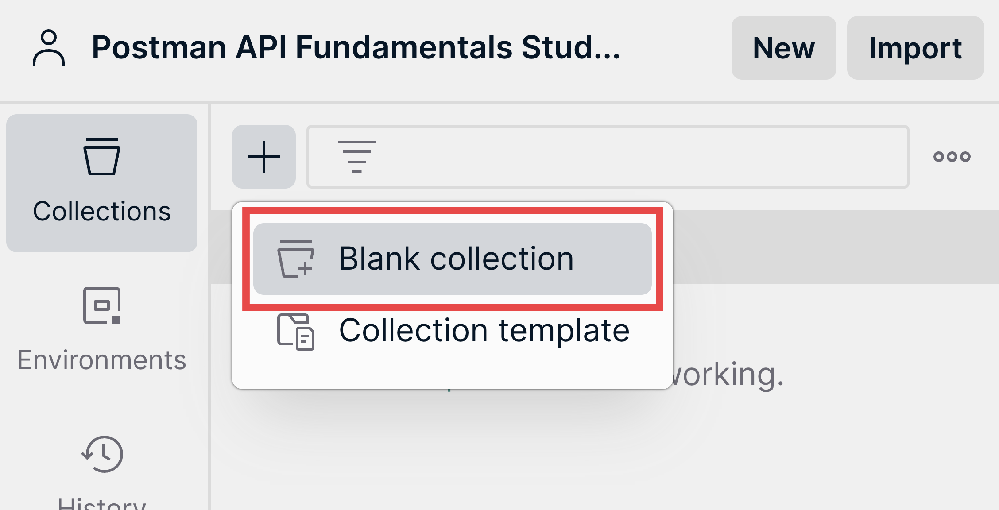
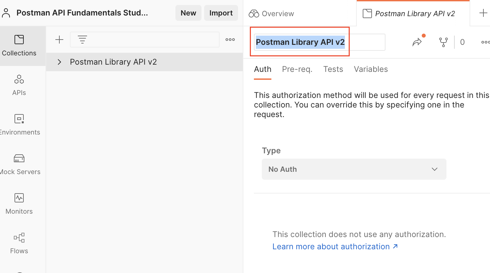

# Overview

- Collection
- Create a collection

&nbsp;

&nbsp;

&nbsp;

# Collection

Collections are places to organize your API requests in Postman.

&nbsp;

&nbsp;

# Create a collection

1. From the left pane, either click the plus ("+") icon or Create a collection.

&nbsp;

2. Select **Blank collection**

&nbsp;

3. Name your new Collection "collection_name"

&nbsp;

&nbsp;

&nbsp;

&nbsp;

&nbsp;
