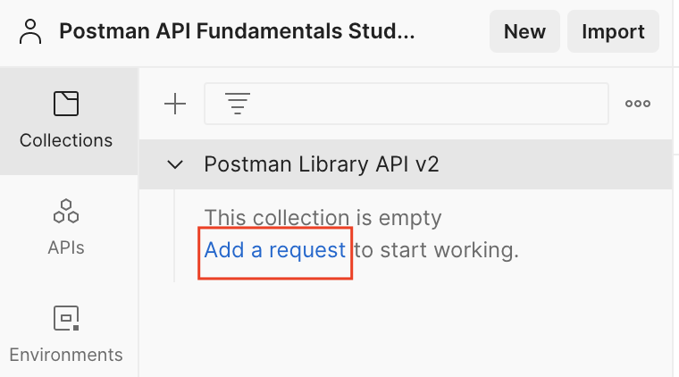
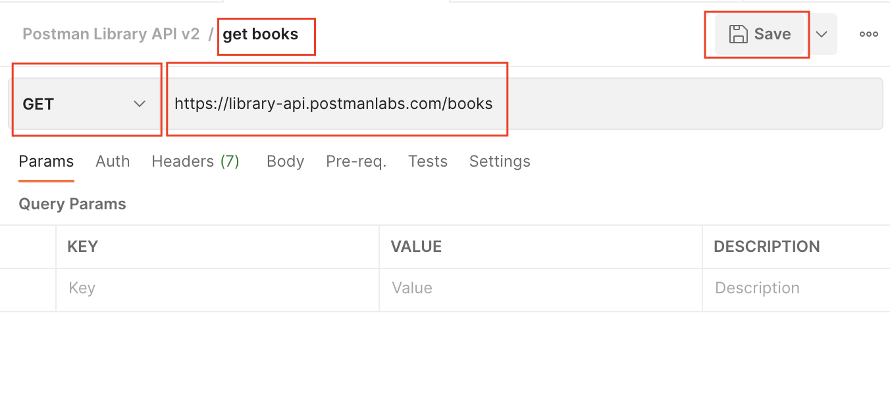
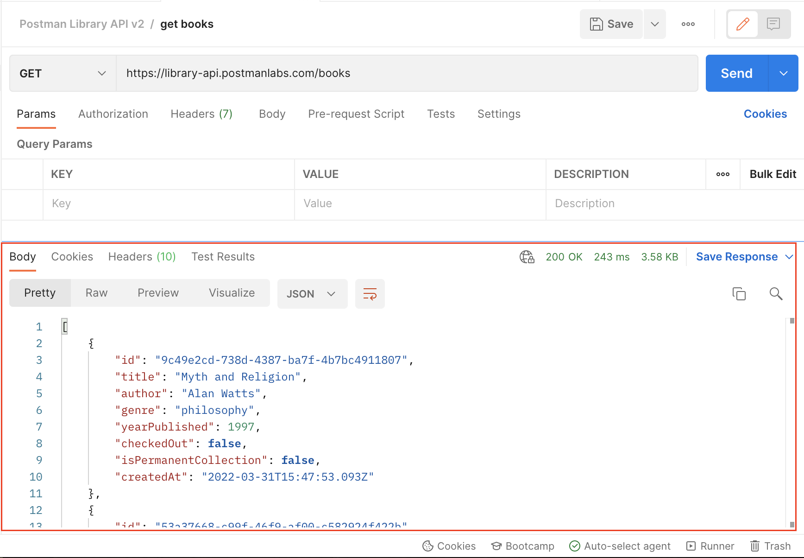

# Overview

- Make your first request
- View the response

&nbsp;

&nbsp;

&nbsp;

# Make your first request

1. Create a new request by either clicking Add a request inside your new Collection or hovering on your Collection, then click the three dots icon and "Add request"

    

&nbsp;

2. Name your request "request_name". Set the request method to GET, and the request URL to GET "<https://library-api.postmanlabs.com/books>"

&nbsp;

- Example

  - URL : <https://library-api.postmanlabs.com/books>
  - Method : GET

    

&nbsp;

3. Send your request by clicking the **Send** button

&nbsp;

&nbsp;

# View the response

If everything goes well, you will see a response from the server in the lower half of Postman.

It should look like this: a **JSON** (JavaScript Object Notation) response body with an **array** of book objects.

&nbsp;

&nbsp;

&nbsp;

&nbsp;

&nbsp;
