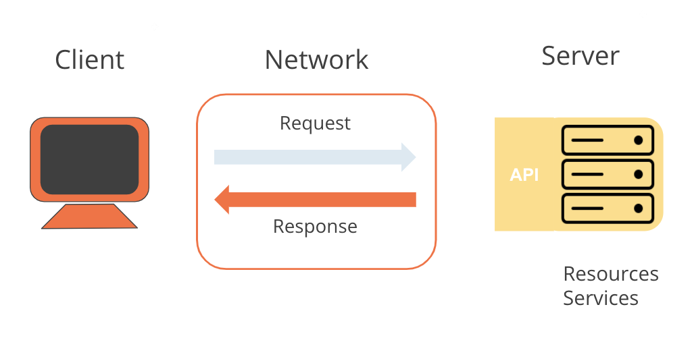

# Overview

- Request-Response pattern

&nbsp;

&nbsp;

&nbsp;

# Request-Response pattern

An API is the interface that lets us know what kind of response to expect when we make certain calls to a server.

You made an HTTP **GET** request to `https://library-api.postmanlabs.com/books` and received a response from the server.

&nbsp;

&nbsp;

The **client** is the agent making a request. A client could be a browser or an application you have coded, for example. In our case Postman is the client because that's how we sent the request.

&nbsp;

The **request** is sent over a network to some server. In our case, we made a request over the public internet to a server located at the address `https://library-api.postmanlabs.com`.

&nbsp;

The server interpreted the request (GET /books) and sent the appropriate response over the network back to the Postman client: a list of books.
