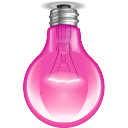

1. To place multiple images in top center

   ```html
   <div id="bulb_container">
     
     
     
     
     
     
   </div>
   ```

   ```css
   #bulb_container {
     display: flex;
     margin-left: auto;
     margin-right: auto;
     width: 90%;
     /* justify-content: center;
     align-items: center; */
   }

   .bulb {
     height: 50px;
     margin: auto;
   }
   ```
