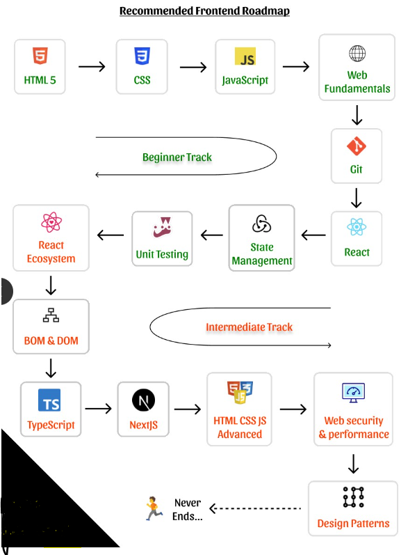

YouTube : [Web Development - Code with Harry](https://www.youtube.com/watch?v=6mbwJ2xhgzM&list=PLu0W_9lII9agiCUZYRsvtGTXdxkzPyItg) <br>

YouTube : [Web Development - WsCube Tech](https://www.youtube.com/watch?v=HVjjoMvutj4)

&nbsp;

## Five layers of software

```md
UI - How data is presented
API - How data is fetched
DATABASE - How data is stored
LOGIC -How data is processed
HOSTING - Where data is stored
```

&nbsp;

# Full-stack dev Roadmap

- Basics of HTML, CSS & JS
- Choosing a framework
- Version Control
- Choose a language for backend
- Head to database
- Devops CI/CD

&nbsp;

&nbsp;

# Front-end Roadmap: [roadmap](https://roadmap.sh/frontend)

### Beginner track : [Beginner Roadmap](https://roadmap.sh/frontend?r=frontend-beginner)

    HTML5 > CSS > JavaScript > Web Fundamentals > Git > React > State Management > Unit testing

### Intermediate track

    React Ecosystem > BOM & DOM > Typescript > NextJS > Advance html css js > Web security & performance > Design patterns



&nbsp;

## Topic details

[learn to become a modern front-end developer](https://www.linkedin.com/posts/himanshumalviya1512_frontend-developer-activity-7031102330196344832-jfVh?utm_source=share&utm_medium=member_desktop)

&nbsp;

# Front-end Development Status

| Topic             | Duration         | Start date | End Date   | Status | Validator                                                  |
| ----------------- | ---------------- | ---------- | ---------- | ------ | ---------------------------------------------------------- |
| HTML              | Day 1 - 7        |            |            | Done   | [HTML code validator](https://validator.w3.org/)           |
| CSS               | Day 8 - 20 (13)  | 05-05-2023 | 16-05-2023 |        | [CSS code validator](https://jigsaw.w3.org/css-validator/) |
| JavaScript        | Day 21 - 35 (15) | 01-06-2023 | 15-06-2023 |        |
| Git               | Day 36 - 37      |            |            |        |
| Web Fundamentals  | Day 38 - 48      |            |            |        |
| Framework (React) | Day 49 - 60      |            |            |        |
| Package Manager   |                  |            |            |        |
| State Management  |                  |            |            |        |
| Unit testing      |                  |            |            |        |
| site generator    |                  |            |            |        |
|                   |                  |            |            |        |

&nbsp;

# Full-stack Development Status

| Topic                        | Duration    |     | Status |
| ---------------------------- | ----------- | --- | ------ |
| HTML                         | Day 1 - 7   | 7   | Done   |
| CSS                          | Day 8 - 20  | 19  | Done   |
| JavaScript                   | Day 21 - 35 | 15  |        |
| Web Fundamentals             | Day 36 - 45 |     |        |
| Responsive Web design        |             | 2   |
| Git                          | Day 47 - 48 |     |        |
| React                        | Day 49 - 60 |     |        |
| State Management             |             |     |        |
| Unit testing                 |             |     |        |
| Bootstrap or Tailwind CSS    | 67-80       |     |        |
| Python or Advance javascript | 81-110      |     |
| Django or nodejs             | 111 - 140   |     |        |
| MySQL                        | 141 - 160   |     |        |
| Rest API or JSON API         | 161 - 172   |     |        |
| AWS                          | 173 - 185   |     |        |
| Recapitulate                 | 186 - 200   |     |        |

|
&nbsp;

&nbsp;

# Sites to deploy website

- Netlify
- Vercel
- Firebase
- Github pages
- Heroku
- Render

&nbsp;

&nbsp;

# What tools do the professionals use?

- A computer.

- A text editor, to write code in.

  - **_text editor_** (e.g. Visual Studio Code, Notepad++, Sublime Text, GNU Emacs, or VIM), or
  - **_hybrid editor_** (e.g. Dreamweaver or WebStorm).

- Web browsers, to test code in. (Firefox, Chrome, Safari, and Microsoft Edge).

- A graphics editor, like GIMP, Figma, Paint.NET, Photoshop, Sketch or XD, to make images or graphics for your web pages.

- A version control system, (Git) , GitHub or GitLab hosting service.

- An FTP program, used on older web hosting accounts to manage files on servers (Git is increasingly replacing FTP for this purpose). There are loads of (S)FTP programs available including Cyberduck, Fetch and FileZilla.

- An automation system, like Webpack, Grunt, or Gulp to automatically perform repetitive tasks, such as minifying code and running tests.

- Libraries, frameworks, etc...
